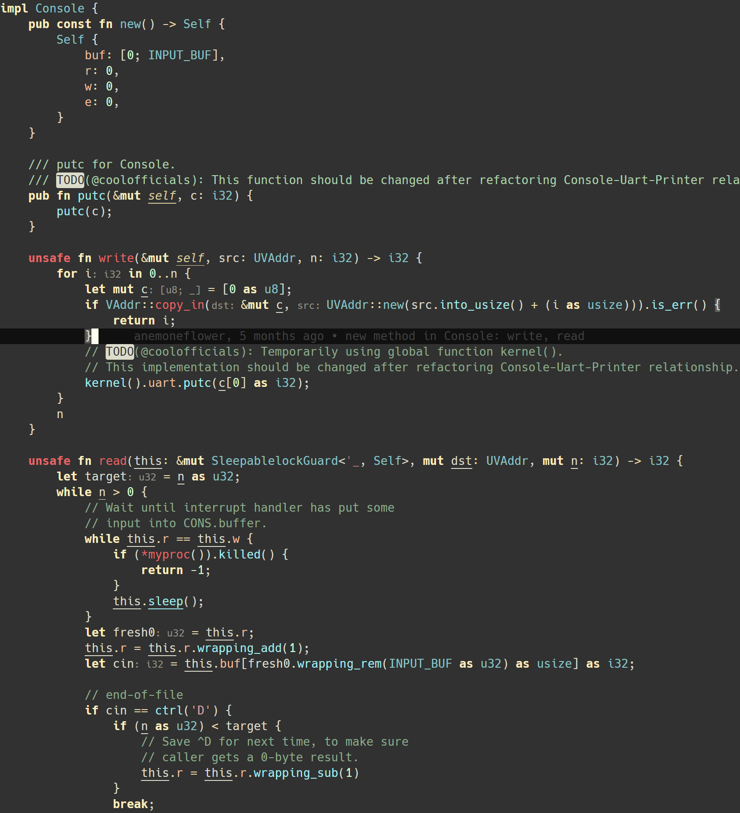
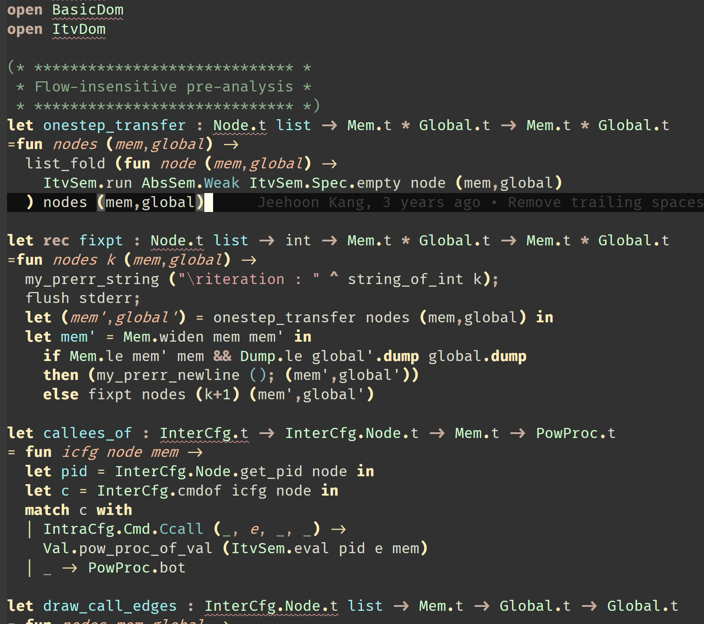
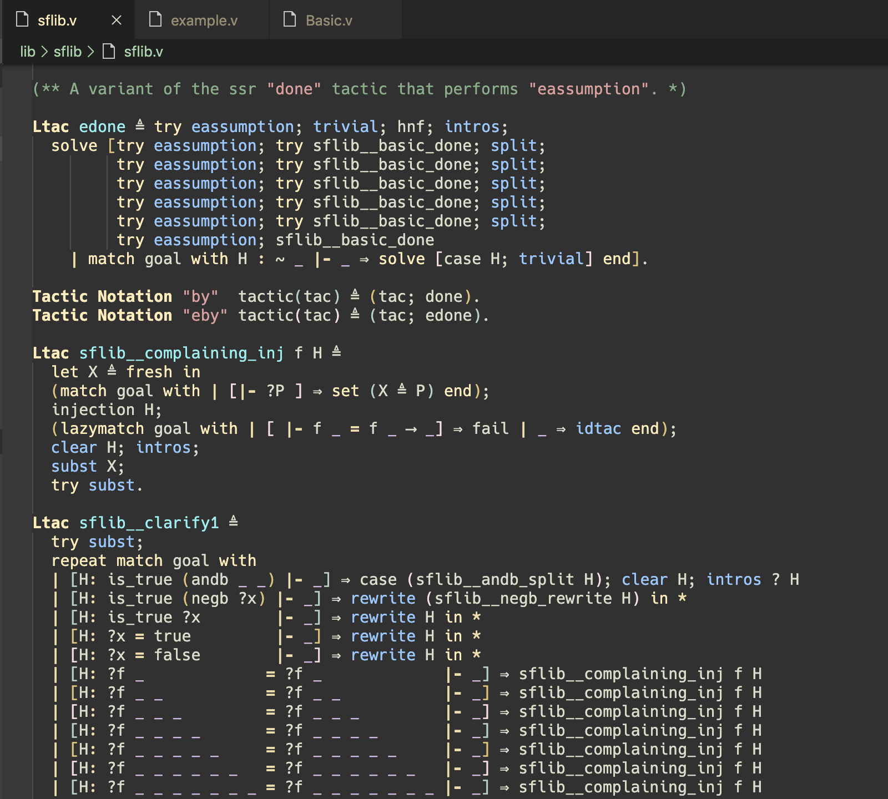
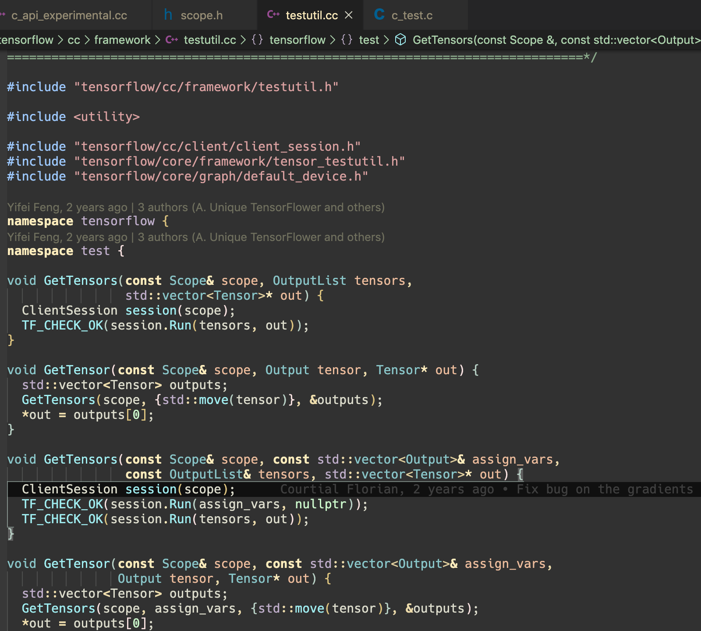
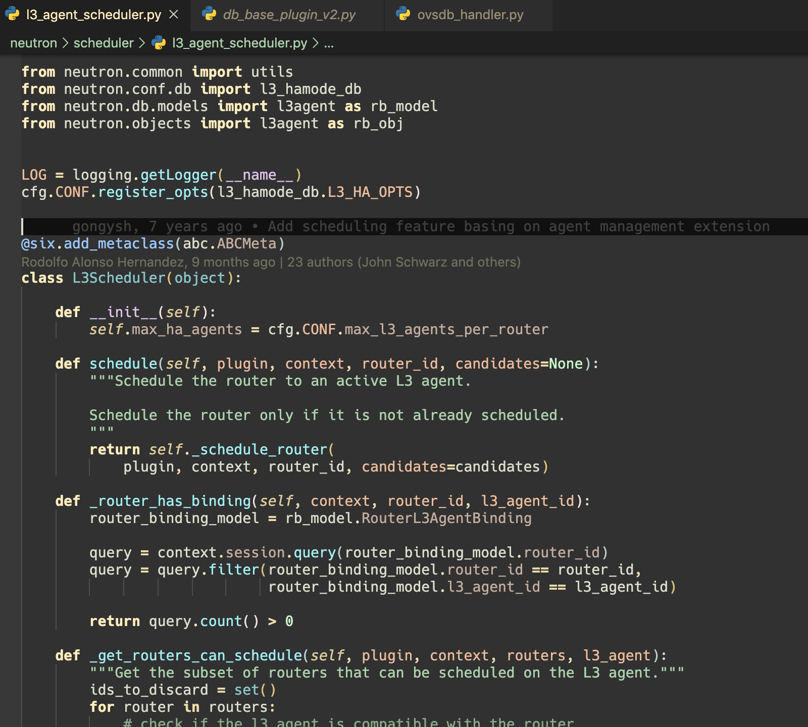

# Higher Contrast Zenburn

A Visual Studio Code theme,

- ported from the Emacs one created by [Nantas Nardelli](https://github.com/edran/hc-zenburn-emacs),
- a higher contrast version of the popular zenburn theme created by [Bozhidar Batsov](https://github.com/bbatsov/zenburn-emacs).

## Language Support *(intended)*

- Rust



- Ocaml



*with [OCaml and Resaon IDE](https://github.com/freebroccolo/vscode-reasonml.git)*

- Coq



*with [VSCoq](https://github.com/coq-community/vscoq.git)*

- C/C++



- Python



## Tips

- If you use [Bracket Pair Colorizer 2](https://github.com/CoenraadS/Bracket-Pair-Colorizer-2), I suggest the color settings below:

```json
{
    "bracket-pair-colorizer-2.colors": [
        "#dbc27e",
        "#f5dfde",
        "#b7cfc4",
    ],
}
```

## License

Copyright (C)2020 Kyeongmin Cho

- Author: Kyeongmin Cho <kyeongmin.cho@kaist.ac.kr>
- URL: [https:github.com/drzix/hc-zenburn-vscode](https:github.com/drzix/hc-zenburn-vscode)

Version 0.1

This program is free software you can redistribute it and/or modify
it under the terms of the GNU General Public License as published by
the Free Software Foundation, either version 3 of the License, or
(at your option) any later version.

This program is distributed in the hope that it will be useful,
but WITHOUT ANY WARRANTY without even the implied warranty of
MERCHANTABILITY or FITNESS FOR A PARTICULAR PURPOSE.  See the
GNU General Public License for more details.

You should have received a copy of the GNU General Public License
along with this program.  If not, see <http://www.gnu.org/licenses/>.

## Credits

- Nantas Nardelli <nantas.nardelli@gmail.com> created the High Contrast
Zenburn theme for emacs, which was a higher contrast version of the emacs Zenburn theme made by Bozhidar Batsov. His repository can be found at: [https://github.com/edran/hc-zenburn-emacs](https://github.com/edran/hc-zenburn-emacs)

- Bozhidar Batsov <bozhidar@batsov.com> created the Zenburn theme
for emacs, which was a port of the vim theme made by Jani Nurminen.
His repository can be found at: [https://github.com/bbatsov/zenburn-emacs](https://github.com/bbatsov/zenburn-emacs)
